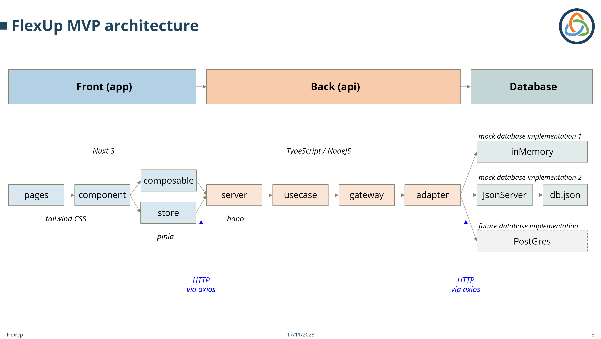

# FlexUp Nuxt MVP

## Overview

This is new repository for the MVP (minimal viable product) of the FlexUp app.

The FlexUp web app, in its final commercial version, will offer a collection of accounting and ERP (entreprise ressource management) tools to help companies and individuals to create and manage their projects, whether they using the classic economic model and/or the new "FlexUp economic model".

## Architecture & Tech Stack

### Project structure

This project is structured as a "quasi-monorepo", with the following parts:

- `app`: contains the front end web app of the FlexUp accounting tool, based on Nuxt 3 (built on Vue 3 Composition API and Vite), Pinia Store, TailwindCSS and TypeScript. It contains the following folders:
  - `pages`:
  - `components`:
  - `composables`:
  - `stores`: Pinia stores
  - `middleware`: authentication, error handling, etc.
  - `assets`: images, fonts, etc.
  - `layouts`: default and custom layouts
- `api`: contains the back end API server of the FlexUp accounting tool, based on a Hono server, and TypeScript.
  - `usecases`: contains the core business logic, in the form of use cases
  - `gateways`: connects the use cases to the adapters with technology-agnotic code
  - `adapters`: connects to the api to external world via technology specific code (API, database, etc.)
  - `server`: contains the Hono server (API routes, middlewares, etc.)
- `lib`: contains the shared libraries, including:
  - `entities`: common types definitions (types, interfaces, enums, etc.)
  - `utils`: contains common utility functions (rounding, formatting, data conversion, etc.)
  - `devUtils`: contains common utility functions used for development (generating index files, mock data, etc.)
- `mock`: contains the mock data used for the development and testing phasing, with two database implementations:
  - `inMemory`: the data is stored in `.ts` files in TypeScript format, one file per entity
  - `jsonServer`: the data is stored in a single `.json` files in JSON format, one entry per entity, served by a jsonServer

### Development philosophy

This project is developed using the following principles:

- **Clean Architecture**: the project is structured using the Clean Architecture principles, where each block can be developed and modified wihout affecting any other block. The "Core" code has the following layers: entities, use cases, gateways and adapters.
- **Test Driven Development**: the whole project is developed using TDD, using Vitest, a Vue 3 testing library based on Jest.
  - **api**: the backend is tested
  - **app**: for now the pages and components are only tested manually in the browser. Everything else (composables, pinia stores and middlewhare) are also tested using Vitest.
- **Functional programming**: the whole project is developed using functional programming principles, where each function is pure, and the data is immutable. We do not use classes for the sake of simplicity and performance.

### Key technologies and libraries

- **TypeScript**: the whole project is written in TypeScript, including the front end, the back end and the shared libraries
- **Nuxt 3**: front end framework built on Vue 3 Composition API and Vite
- **Pinia**: state management for the front end web app
- **TailwindCSS**: utility-first CSS framework
- **Hono**: API server
- **Vitest**: testing framework built on Jest
- **NodeJS**: runtime environment for the back end API server
- **pnpm**: package manager
- **volta** : node and tool version manager
- **ESLint**: linting
- **Prettier**: formatting
- **jsonServer**: database mock server
- **jwt**: Json Web Tokens for authentication

### Other potential & future technologies

These technologies have not yet been (fully) implemented, but are planned for the future:

_Code_

- **PostGreSQL**: SQL database in production stage
- **Prisma**: ORM for PostGreSQL
- **Pug**: HTML template engine
- **msw**: API mocking library / service worker
- **bycript**: password hashing library
- **cuid2**: unique id generator
- **joi**: schema validation library

_Infrastructure:_

- **CloudFlare** : workers, DNS, cybersecurity, storage (static pages), QA (quality assurance / staging server)
- **CircleCI** : continuous integration (tests)
- **Netlify** : storage (PWA for market place) \*PWA: progressive web application -**Digital Ocean** : docker (API/micro-service, persistence: JSon server, PostgreSQL, KeyCloak, Vault, Redis, Traefik (reverse proxy))
- **DockerHub** : docker (exec images)
- **KeyCloak** : authentication
- **AWS S3** : storage (static files / media)
- **Upstash** : Redis database
- **Pulumi** : IAAS (infrastructure as a script)
- **ElasticSearch** : search engine

_Other tools:_

- **GitHub** : Repository
- **Notion** : spec, taks, minutes, bookmarks, todos
- **Figma** : UI / UX
- **Postman** : Rest requests
- **DropBox** : document sharing
- **Office** : Word, Excel
- **Access**: MVP, fast-prototyping, model development, UX/UI pre-design, temporary working accounting tool

## Installation

### Prerequisites

- [NodeJS](https://nodejs.org/en/) v18.18.0 +
- [pnpm](https://pnpm.io/) v8.7.6 +
- [VS Code](https://code.visualstudio.com/) (or any other IDE)

### Installation

- download this repo to your local directory
- `pnpm install` : installs the packages
- `pnpm rmock` : launches several sucessive actions
  - `pnpm generate-index`: updates the index files according to the selected mock database (inMemory or jsonServer)
  - `pnpm generate-inMemory-index`updates the `inMemory/index.ts`, which serves as a the `inMemory` mock database
  - `pnpm reset-json-server`: updates the `db.json` file, which serves as a the `jsonServer` mock database using, and is generated from the `inMemory` data
  - `pnpm mock`: launches the jsonServer (only required for the `jsonServer` mock database implementation and for testing)
- `pnpm prepare` : creates the `.nuxt` directory in your application and generates types

### Database and `.env` configuration

You can chose between two mock databases:

- `inMemory` : the data is stored in `.ts` files in TypeScript format, one file per entity
- `jsonServer` : the data is stored in a single `.json` files in JSON format, one entry per entity

The selection is made in the `.env`: `STORAGE_TYPE=inMemory` or `STORAGE_TYPE=jsonServer`. The `.env` file is located in the root directory of the project.

> _Important_: make sure to run `pnpm rmock` or `pnpm generate-index` after changing the `.env` file to redirect the adapter index files to the correct mock database.

## Usage

Follow the steps below to launch the app:

1. `pnpm mock` : launches the jsonServer (only required for the `jsonServer` mock database implementation and for testing), or `pnpm rmock` to also reset the index files
2. `pnpm hono` : launches the Hono API server
3. `pnpm test` : launches the tests in Vitest
4. `pnpm dev` : launches the Nuxt 3 app
